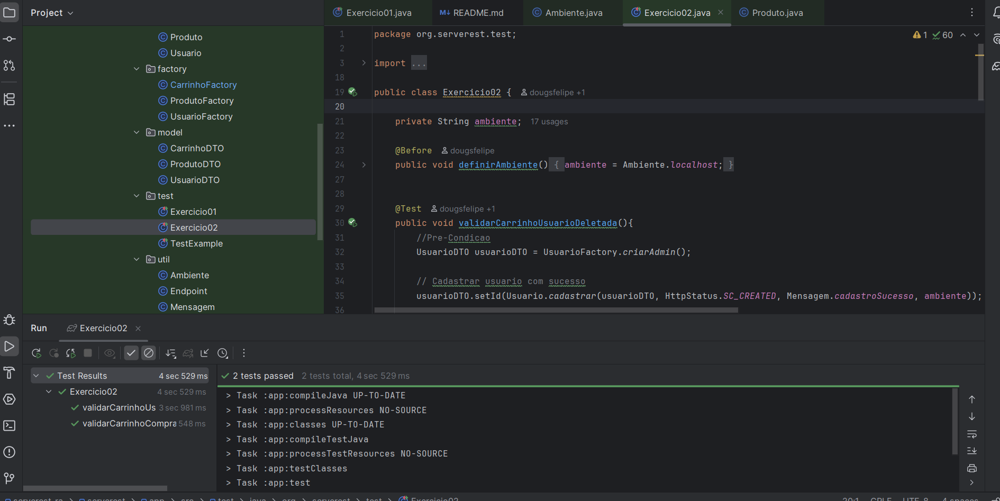

# 🧪 Serverest RA – Testes Automatizados de API com REST Assured

Este projeto demonstra o uso do **REST Assured** para automação de testes da API [ServeRest](https://serverest.dev/), focado em testes de fluxo como cadastro, login e manipulação de produtos e carrinhos.

## 📁 Estrutura

- `src/test/java/org/serverest/test/Exercicio02.java`: classe principal de teste com casos automatizados.
- `controller/`, `factory/`, `model/`: camadas organizadas para melhor manutenção e reutilização de código.

## 🚀 Pré-requisitos

Antes de rodar os testes, garanta que você tenha:

- Java JDK 8 ou superior
- Maven instalado
- IntelliJ ou outro IDE Java
- ServeRest rodando localmente em `http://localhost:3000` ou no ambiente oficial `https://serverest.dev` 
  Você pode iniciar com Docker:

## 📦 Instalação

Clone o repositório:

```bash
git clone https://github.com/dougsfelipe/ServerRestAPI.git
cd ServerRestAPI
```

Importe o projeto na sua IDE (ex: IntelliJ) como um projeto **Maven**.

## 🔧 Como rodar o teste `Exercicio02.java`

1. Navegue até a classe:
   ```
   src/test/java/org/serverest/test/Exercicio02.java
   ```

2. Execute o teste pela IDE 




## 📝 Observações

- Foram adicionadas fábricas e métodos auxiliares para facilitar os testes.
- A estrutura foi adaptada para refletir corretamente os dados retornados pela API.

## 👥 Dupla

- Douglas Felipe Candido dos Santos  
- Alessandra Almeida
